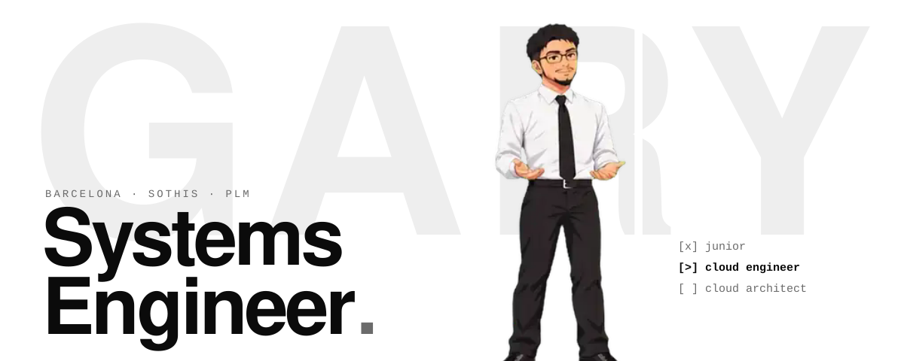
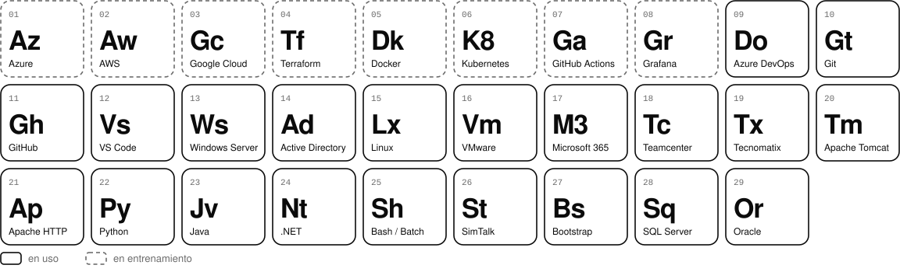

<p align="center">
  <picture>
    <source media="(prefers-color-scheme: dark)" srcset="assets/header-dark.svg">
    
  </picture>
</p>

<p align="center">
  <a href="https://ryancloudops.github.io/Page/"><picture><source media="(prefers-color-scheme: dark)" srcset="assets/btn-portfolio-dark.svg"></picture></a>
  &nbsp;
  <a href="https://ryancloudops.github.io/Page/cv-gary-flores.pdf"><picture><source media="(prefers-color-scheme: dark)" srcset="assets/btn-cv-dark.svg"></picture></a>
  &nbsp;
  <a href="https://www.linkedin.com/in/gary-bryan-flores-pe%C3%B1afiel"><picture><source media="(prefers-color-scheme: dark)" srcset="assets/btn-linkedin-dark.svg"></picture></a>
  &nbsp;
  <a href="mailto:pflores.gary@gmail.com"><picture><source media="(prefers-color-scheme: dark)" srcset="assets/btn-email-dark.svg"></picture></a>
</p>

<br>

## Hola, soy Gary.

**Systems Engineer** en el departamento PLM de **Sothis** (Barcelona). Vengo de la administración de sistemas, la virtualización y el soporte técnico, y ahora subo de nivel en **Cloud y DevOps** con el objetivo de llegar a **Cloud Architect**.

Estudio Ingeniería Informática en la Universitat Oberta de Catalunya y hablo español, catalán e inglés.

> *Always learning, always building, always moving forward.*

<sub>EN — Systems Engineer at Sothis (PLM), moving from sysadmin and virtualization into Cloud and DevOps. Goal: Cloud Architect. BSc Computer Engineering at UOC. Spanish, Catalan, English.</sub>

```text
$ whoami
gary · systems engineer -> cloud architect

$ kubectl get pods -n career
NAME               READY   STATUS
junior-engineer    1/1     Completed
cloud-engineer     1/1     Running
cloud-architect    0/1     Pending
```

<br>

## Skills

<p align="center">
  <picture>
    <source media="(prefers-color-scheme: dark)" srcset="assets/periodic-dark.svg">
    
  </picture>
</p>

**Nube:** Azure como principal · AWS en formación · GCP en la ruta.

<br>

## Experiencia

| Periodo | Empresa | Rol |
|---|---|---|
| **Jul 2023 – actualidad** | **Sothis** | Systems Engineer · Departamento PLM: Siemens Teamcenter y Tecnomatix (instalación, migración y mantenimiento), Azure DevOps, Tomcat, SQL Server, Windows Server / Active Directory |
| Abr 2022 – Abr 2023 | Alten Spain | Desarrollador de software: SQL Server, Report Builder, .NET, Bootstrap, Git |
| Jun 2021 – Nov 2021 | Clicc | Technical Support Help Desk: Microsoft 365, Active Directory, Windows y Linux |

**Formación:** Grado en Ingeniería Informática (UOC, 2024–2028) · CFGS DAM (2021–2023) · CFGS ASIR (2020–2022), Institut Joan d'Àustria.

<br>

## Certificaciones y objetivos

- **Hechas:** Technical Support Associate · Technical Support Manager · Experto en Virtualización VMware · Servidor Web Apache 2.4 · Planificación de copias de seguridad
- **Próximas:** AWS Cloud Practitioner · Azure AZ-104 · HashiCorp Terraform Associate

## Roadmap

| Nivel | Foco | Estado |
|---|---|---|
| 01 · Fundamentos | Linux, redes, Windows Server, AD, virtualización, Git | Completado |
| 02 · Nube e IaC | AWS / Azure, Docker, Terraform, CI/CD | **En curso** |
| 03 · Plataforma y operación | Kubernetes, Helm, observabilidad, costes, alta disponibilidad | Siguiente |
| 04 · Cloud Architect | Landing zones, redes híbridas, Well-Architected | Objetivo |

<br>

## Contacto

¿Buscas a alguien para tu equipo de sistemas o cloud? Escríbeme por [email](mailto:pflores.gary@gmail.com), [LinkedIn](https://www.linkedin.com/in/gary-bryan-flores-pe%C3%B1afiel) o échale un vistazo a mi [portfolio](https://ryancloudops.github.io/Page/).

<p align="center"><sub>© RyanCloudOps</sub></p>
